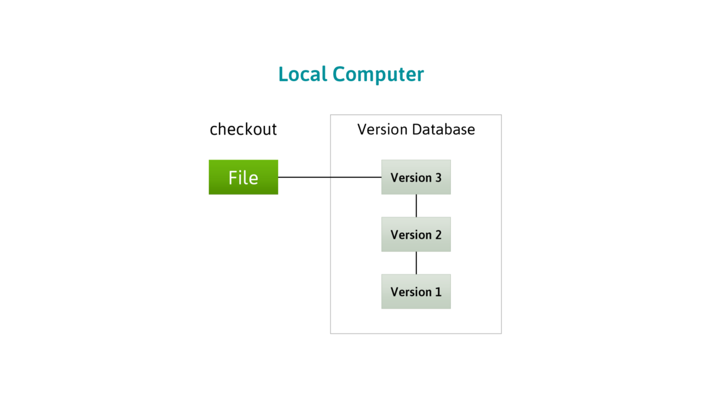

# What is Git after all?

Distributed Version Control System - All Repositories are equal even your local one!

* https://www.atlassian.com/git/tutorials/what-is-git
* https://www.atlassian.com/git/tutorials/learn-git-with-bitbucket-cloud

From https://medium.com/@eduoshaun/difference-between-git-and-github-807f1a57d438

## Install Git locally
https://git-scm.com/downloads

## Start using the repo run in terminal: 
**git clone https://github.com/ValRCS/LU_PySem_2019.git**
* clones whole repo in the current working directory from which you run git clone

* git log shows revision history with SHA1 hash value for each revision

## Version
* git --version   shows current git version

## Update automagically original repo: *git pull* from the same directory
* git pull is like two commands into one
* git fetch + git merge pulls changes from default origin(this repo) into your local repo and merges them 

## Edit/Move Files in local clone from command line terminal
* git status show current status
* git add . from project root to stage changes
* git status to make sure
* git commmit -m "My helpful commit message" to commmit **locally**
* git push origin to push back to master repo (Github will ask to login and pw if no SSH set)

## If you want to work on specific revision
* git clone URL 
* cd to Projectdirectory
* git reset --hard SHA1 where SHA1 is SHA1 of the revision you want

* git pull to get back to HEAD revision

## Reset to master branch

* git fetch --all
* git reset --hard origin/master
Note: this will overwrite any changes you might have made to the files locally

### Various workflows: https://www.atlassian.com/git/tutorials/comparing-workflows

